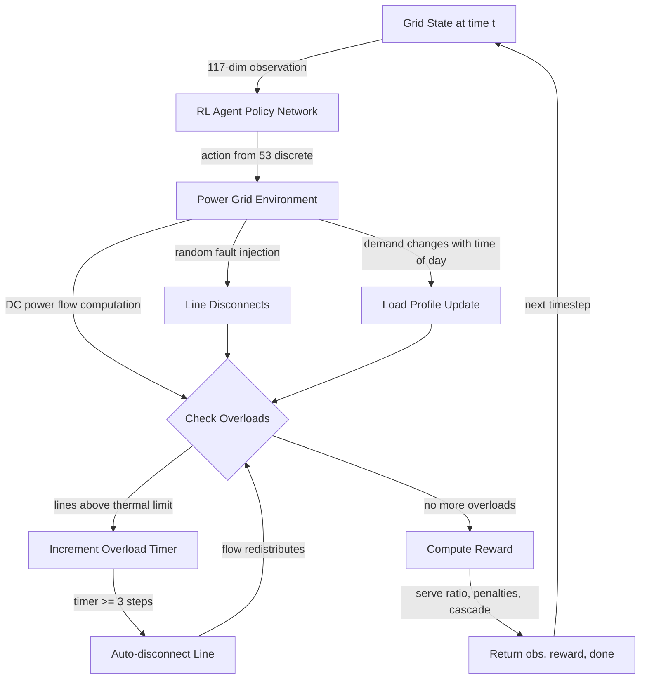
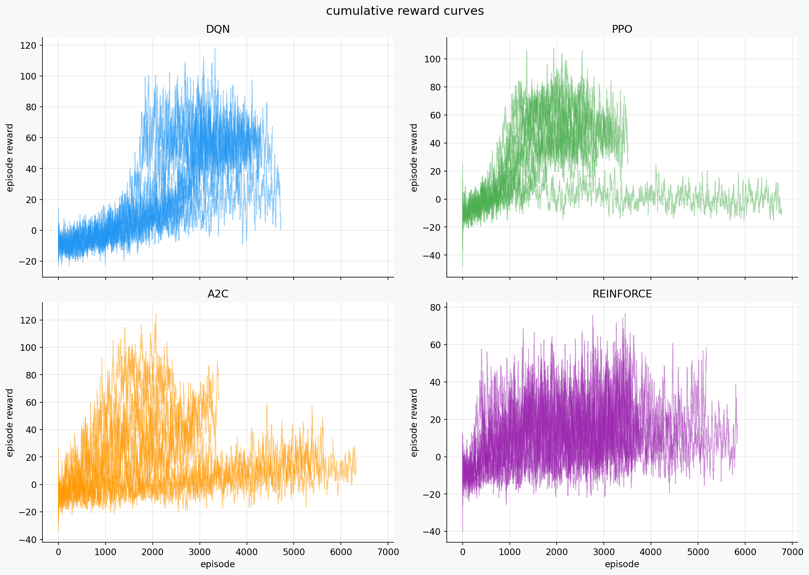
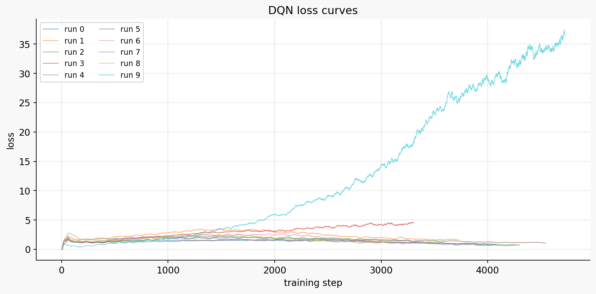
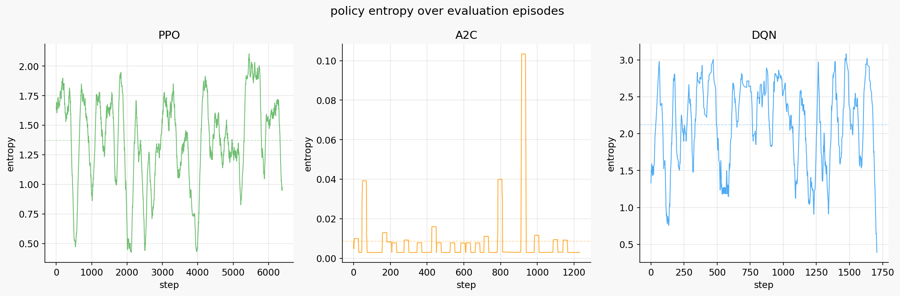
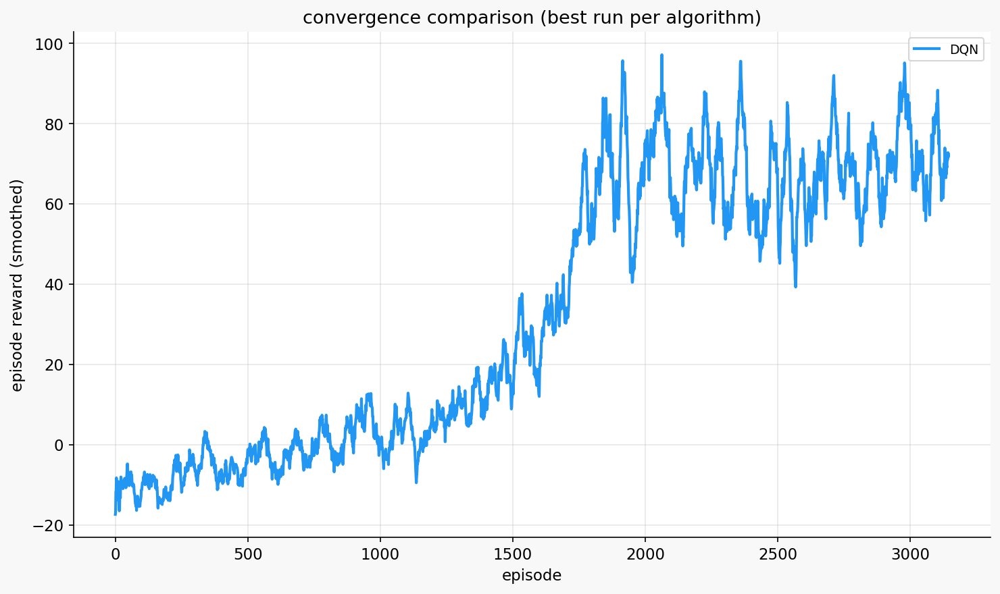
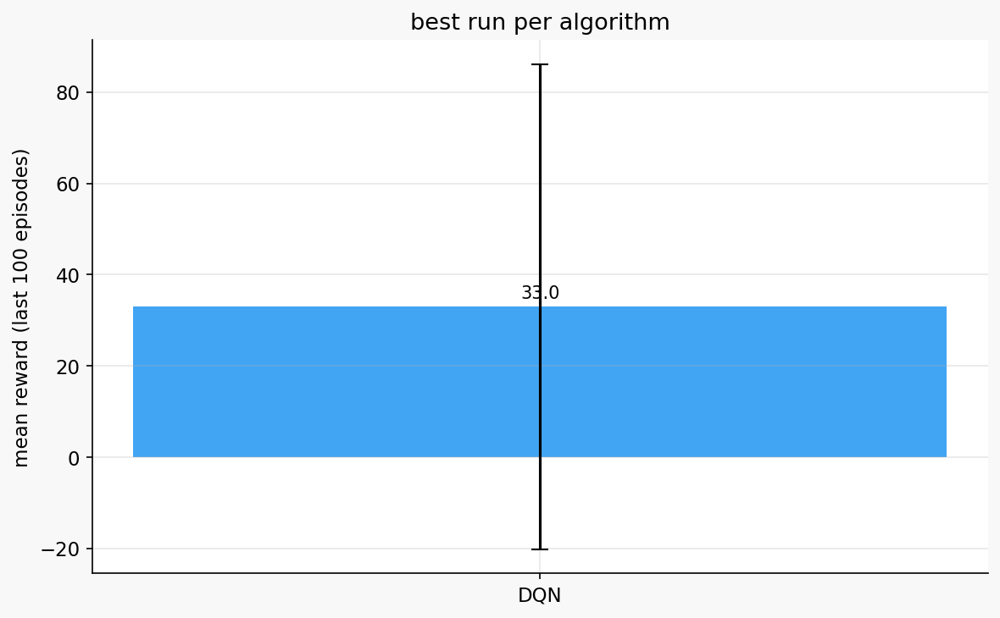

# Reinforcement Learning for Power Grid Cascading Failure Mitigation

## Project overview

The idea here is to train an RL agent that can operate a simulated power grid, one that is modeled on the Lagos/EKEDC network in Nigeria. It is a modified IEEE 14-bus system with 14 substations, 20 transmission lines, and 5 generators. Every step, the agent has to decide whether to shed load, switch lines, or adjust generators to try and stop cascading overloads before the whole grid goes down. I trained four algorithms on this (DQN, REINFORCE, PPO, A2C) and compared them. PPO ended up keeping the grid alive 14x longer than a random agent and reduced cascading failures by 96%.

## Environment description

### Agent

The agent sort of acts as an automated grid operator for the EKEDC network. Each timestep it gets the full state of the 14 buses, 20 lines, and 5 generators, and then picks one of 53 actions. It can shed or restore load at consumer buses, toggle lines, adjust generator output. It has no control over random fault events or the power flow physics though, it can only react to what is happening. The goal is to keep serving as much load as possible and not let cascading failures bring the grid down, over a 1000-step episode.

### Action space

Discrete, 53 actions total:

- Action 0: do nothing
- Actions 1-11: shed load at one of 11 load buses (reduces demand by 20% per action, caps at 100%)
- Actions 12-22: restore previously shed load at one of 11 load buses (increases demand back by 20%)
- Actions 23-42: toggle one of 20 transmission lines (disconnect or reconnect, 5-step cooldown after each toggle)
- Actions 43-47: increase output of one of 5 generators by 10% of max capacity (limited by ramp rate)
- Actions 48-52: decrease output of one of 5 generators by 10% of max capacity

Invalid actions (e.g. restoring load that was never shed, toggling a line on cooldown) get a small penalty of -0.05 and are treated as do-nothing.

### Observation space

117-dimensional continuous vector (float32):

Per line (20 lines x 3 = 60 values): loading ratio (flow / thermal limit), connection status (0/1), overload timer (consecutive steps above limit, auto-disconnects at 3).

Per bus (14 buses x 3 = 42 values): voltage magnitude (per-unit), net power injection, load shed indicator (0/1).

Per generator (5 generators x 2 = 10 values): output as fraction of max capacity, availability (0/1).

Global (5 values): total demand, total generation, time of day, count of overloaded lines, count of disconnected lines.

### Reward structure

R(t) = +2.0 * (load served / total demand)
       -1.0 * sum of overload excess across all lines
       -0.5 * (load shed / total demand)
       -0.3 * (disconnected lines / total lines)
       -10.0 * cascade occurred (1 if any line auto-disconnected this step)
       -0.1 * (action != do nothing)
       -0.5 * sum of voltage violations beyond tolerance
       -0.05 * invalid action

The serve ratio (+2.0) is what the agent is mostly trying to maximize. The cascade penalty (-10.0) is the harshest part and it ends up dominating what the agent actually learns to care about. The -0.1 action cost just discourages the agent from doing things when the grid is fine.

Episode ends if load served drops below 30% or 8 or more lines go down. If the agent gets to 1000 steps without that happening, it survives.

### Agent diagram

## System analysis and design

### Deep Q-Network (DQN)

DQN takes the 117-dim observation and outputs Q-values for all 53 actions through an MLP. It stores past transitions in a replay buffer (50k-100k) and samples from them to train. This helps because consecutive grid states tend to be heavily correlated. There is a separate target network that gets copied over from the main one every 500-2000 steps so the Q-value targets do not shift around too much. Exploration is epsilon-greedy, linearly decaying from 1.0 down to some small final value.

### REINFORCE

I had to write this one from scratch in PyTorch because SB3 does not have vanilla REINFORCE. It is a simple MLP with softmax output over 53 actions. The agent plays out a full episode, computes discounted Monte Carlo returns, normalizes them, then does one gradient update. I added gradient clipping because the updates were too noisy without it. It is on-policy so it only ever learns from what it just experienced, and that makes it slower than DQN which has a replay buffer. The gradient estimates are unbiased though.

### PPO (Proximal Policy Optimization)

SB3 implementation with an MLP policy. PPO clips the surrogate objective so the policy cannot change too much in a single update. It uses GAE (Generalized Advantage Estimation) for lower variance advantage estimates and runs multiple epochs of mini-batch updates on each collected rollout. Entropy regularization keeps it from getting too greedy too early.

### A2C (Advantage Actor-Critic)

Also SB3. Shared feature layers that feed into separate policy and value heads. It updates synchronously using n-step returns. The vf_coef parameter controls how much weight the value function loss gets, and entropy regularization prevents it from collapsing to a single action.

## Implementation

### DQN hyperparameter sweep (10 runs, 100,000 steps each)

| Run | LR | Gamma | Buffer | Batch | Explore Frac | Final Eps | Target Update | Net Arch | Mean Reward | Last 100 Mean |
|-----|------|-------|--------|-------|-------------|-----------|--------------|----------|-------------|--------------|
| 0 | 3e-4 | 0.90 | 100k | 128 | 0.5 | 0.05 | 1000 | [200,200,200] | 21.30 | 59.17 |
| 1 | 1e-4 | 0.95 | 100k | 128 | 0.4 | 0.02 | 500 | [256,256] | 22.88 | 61.34 |
| 2 | 5e-4 | 0.90 | 50k | 64 | 0.5 | 0.05 | 1000 | [128,128,128] | 18.15 | 53.96 |
| 3 | 3e-4 | 0.99 | 100k | 128 | 0.3 | 0.01 | 1000 | [200,200,200] | 29.09 | 53.75 |
| 4 | 1e-3 | 0.90 | 50k | 64 | 0.5 | 0.10 | 500 | [128,128] | 19.48 | 56.11 |
| 5 | 1e-4 | 0.90 | 100k | 128 | 0.6 | 0.05 | 2000 | [256,256,256] | 16.21 | 50.68 |
| **6** | **5e-4** | **0.95** | **50k** | **64** | **0.4** | **0.02** | **1000** | **[200,200]** | **29.34** | **76.84** |
| 7 | 3e-4 | 0.90 | 100k | 128 | 0.5 | 0.05 | 500 | [128,128] | 21.85 | 67.64 |
| 8 | 1e-3 | 0.95 | 50k | 64 | 0.3 | 0.01 | 1000 | [64,64] | 32.99 | 70.32 |
| 9 | 5e-3 | 0.99 | 100k | 128 | 0.3 | 0.10 | 1000 | [256,256] | 8.64 | 24.24 |

Run 6 was the best one (lr=5e-4, gamma=0.95, [200,200]). Middle of the road learning rates did well. Run 9 with lr=5e-3 sort of never learned anything meaningful, and I think that is because the Q-values were constantly overshooting. Smaller buffers with smaller batches seemed to help since updates happened more frequently.

### PPO hyperparameter sweep (10 runs, 100,000 steps each)

| Run | LR | Gamma | Clip | N Steps | Batch | Epochs | Ent Coef | GAE Lambda | Net Arch | Mean Reward | Last 100 Mean |
|-----|------|-------|------|---------|-------|--------|----------|------------|----------|-------------|--------------|
| 0 | 1e-4 | 0.95 | 0.2 | 512 | 128 | 40 | 0.05 | 0.95 | [256,256] | 28.88 | 46.55 |
| 1 | 1e-4 | 0.99 | 0.1 | 512 | 128 | 20 | 0.01 | 0.90 | [128,128,128] | 34.55 | 68.58 |
| 2 | 1e-4 | 0.95 | 0.1 | 512 | 64 | 10 | 0.05 | 0.95 | [256,256] | 28.33 | 57.16 |
| 3 | 3e-4 | 0.90 | 0.2 | 1024 | 128 | 20 | 0.01 | 0.90 | [200,200,200] | 36.43 | 62.51 |
| 4 | 1e-4 | 0.99 | 0.2 | 512 | 64 | 10 | 0.01 | 0.90 | [256,256] | 43.62 | 73.21 |
| 5 | 1e-4 | 0.95 | 0.3 | 1024 | 64 | 40 | 0.10 | 0.90 | [256,256] | 24.75 | 47.65 |
| 6 | 1e-4 | 0.99 | 0.3 | 2048 | 128 | 40 | 0.10 | 0.95 | [256,256] | 22.65 | 55.06 |
| **7** | **5e-4** | **0.95** | **0.3** | **1024** | **128** | **20** | **0.01** | **0.90** | **[128,128,128]** | **38.29** | **64.30** |
| 8 | 5e-4 | 0.95 | 0.2 | 512 | 128 | 40 | 0.05 | 0.95 | [200,200,200] | 1.60 | -3.38 |
| 9 | 1e-4 | 0.99 | 0.3 | 1024 | 64 | 10 | 0.05 | 0.90 | [256,256] | 35.68 | 70.95 |

Run 7 performed the best (lr=5e-4, gamma=0.95, clip=0.3, [128,128,128]). Low entropy (0.01) consistently worked well. Run 8 went negative, and I think that happened because having lr=5e-4 together with 40 epochs per update was too aggressive and the policy just kept overshooting. Other than that one failure though, PPO was the most consistent algorithm. Even the mediocre PPO runs did better than the best REINFORCE run.

### A2C hyperparameter sweep (10 runs, 100,000 steps each)

| Run | LR | Gamma | N Steps | Ent Coef | VF Coef | Grad Norm | Net Arch | Mean Reward | Last 100 Mean |
|-----|------|-------|---------|----------|---------|-----------|----------|-------------|--------------|
| 0 | 1e-4 | 0.90 | 64 | 0.10 | 0.25 | 0.5 | [200,200,200] | 6.53 | 24.67 |
| 1 | 1e-4 | 0.99 | 32 | 0.10 | 0.25 | 10.0 | [128,128] | 2.60 | 27.93 |
| 2 | 3e-4 | 0.95 | 32 | 0.05 | 0.25 | 0.5 | [128,128] | 16.69 | 22.60 |
| 3 | 3e-4 | 0.99 | 64 | 0.05 | 0.50 | 10.0 | [128,128] | 17.71 | 62.70 |
| 4 | 3e-4 | 0.95 | 16 | 0.10 | 0.50 | 1.0 | [128,128] | 21.62 | 63.41 |
| 5 | 7e-4 | 0.90 | 16 | 0.05 | 0.50 | 0.5 | [128,128] | 36.61 | 56.88 |
| 6 | 3e-4 | 0.95 | 16 | 0.10 | 0.25 | 10.0 | [200,200,200] | 36.52 | 70.53 |
| 7 | 1e-4 | 0.90 | 64 | 0.10 | 0.25 | 10.0 | [128,128] | 0.91 | 16.20 |
| **8** | **7e-4** | **0.99** | **32** | **0.01** | **0.50** | **1.0** | **[200,200,200]** | **38.86** | **83.15** |
| 9 | 3e-4 | 0.90 | 16 | 0.01 | 0.75 | 1.0 | [200,200,200] | 53.15 | 95.18 |

Run 8 did the best (lr=7e-4, gamma=0.99, [200,200,200]). A2C turned out to really care about vf_coef. Runs with 0.50-0.75 did well, the ones with 0.25 did not. I think the value function needs a strong training signal here because the reward varies so much. Shorter n_steps (16-32) also outperformed longer ones (64), probably because grid management is reactive and you need to respond to faults quickly rather than plan 64 steps into the future. Low entropy (0.01) won here as well.

### REINFORCE hyperparameter sweep (10 runs, 100,000 steps each)

| Run | LR | Gamma | Net Arch | Grad Norm | Mean Reward | Last 100 Mean |
|-----|------|-------|----------|-----------|-------------|--------------|
| 0 | 5e-4 | 0.95 | [128,128] | 5.0 | 10.63 | 20.42 |
| 1 | 5e-4 | 0.99 | [200,200,200] | 10.0 | 13.31 | 11.84 |
| 2 | 3e-4 | 0.90 | [128,128] | 5.0 | 9.69 | 20.94 |
| 3 | 5e-4 | 0.95 | [256,256] | 1.0 | 19.36 | 15.35 |
| 4 | 3e-4 | 0.90 | [256,256] | 10.0 | 15.54 | 28.15 |
| 5 | 1e-4 | 0.99 | [128,128] | 5.0 | -0.56 | 13.38 |
| 6 | 5e-4 | 0.99 | [256,256] | 1.0 | 16.49 | 30.85 |
| 7 | 5e-4 | 0.99 | [200,200,200] | 1.0 | 8.54 | 8.75 |
| **8** | **1e-4** | **0.90** | **[256,256]** | **1.0** | **5.58** | **31.12** |
| 9 | 1e-3 | 0.95 | [128,128] | 10.0 | 19.77 | 26.38 |

Run 8 came out best (lr=1e-4, gamma=0.9, [256,256]). Lower gamma values did better, and I think that is because when a cascade starts the penalty hits immediately, not 50 steps from now. The agent needs to prioritize what is happening right in front of it. Tight gradient clipping (1.0) helped a lot too because without it the updates were far too noisy. REINFORCE was the most inconsistent of the four. Some runs picked up something useful, others barely moved at all.

### Extended training (1,000,000 steps, best hyperparameters per algorithm)

| Algorithm | Final 100 Mean | Mean Reward | Max Reward | Episodes |
|-----------|---------------|-------------|------------|----------|
| **PPO** | **211.60** | 93.74 | 1177.02 | 12,143 |
| DQN | 158.62 | 40.03 | 969.72 | 27,842 |
| REINFORCE | 62.10 | 38.27 | 384.60 | 26,922 |
| A2C | 32.16 | 23.13 | 353.33 | 26,546 |

A2C is the odd result here. It went from 83.15 at 100k down to 32.16 at 1M, so more training actually made it worse. I am not entirely sure why, but I think without PPO's clipping the policy updates got increasingly destructive the longer training went on. The 100k model ended up being genuinely better than the 1M one.

## Results discussion

### Cumulative rewards

PPO has the smoothest upward curve with the least noise between runs. DQN is all over the place early on because it is still randomly exploring, but it calms down once epsilon decays. A2C picks things up fast in the first thousand episodes then mostly stops improving. REINFORCE is noisy the whole way through and a lot of the runs never really get going.

### Training stability

DQN loss is spiky early on while the replay buffer fills up, then it settles down. A few runs with extreme learning rates never really stabilize though. On the entropy side, PPO keeps its entropy up for longer, meaning it is still exploring while it learns. A2C drops entropy faster and commits to a policy sooner. REINFORCE entropy is noisy the whole time, which tracks with its high variance gradients.

### Episodes to converge

PPO reaches a stable policy around the 3,000 to 5,000 episode mark and continues improving at 1M steps. DQN does not really start learning until exploration decays enough, about 40% through training, but then it catches up quickly. A2C is the fastest to start improving but it plateaus early. REINFORCE barely converges within 100k steps for most of the runs.

### Best run comparison

PPO at 1M steps gets nearly double the reward of DQN. The gap is probably because PPO can make big but safe policy updates through clipping, while DQN has to accurately estimate Q-values for all 53 actions which is a harder problem.

### Generalization

Evaluation on 50 unseen episodes (different random seeds from training):

| Agent | Survival Rate | Mean Reward | Mean Steps | Load Served | Cascades/Episode |
|-------|--------------|-------------|------------|-------------|-----------------|
| Random | 0% | -15.58 | 8.2 | 98.5% | 6.08 |
| Do-nothing | 0% | -0.68 | 17.7 | 100.0% | 7.58 |
| REINFORCE 1M | 0% | 50.90 | 43.0 | 95.7% | 2.10 |
| A2C 100k | 0% | 75.19 | 62.9 | 100.0% | 0.62 |
| DQN 1M | 0% | 178.09 | 113.0 | 99.0% | 0.92 |
| **PPO 1M** | **0%** | **309.06** | **255.0** | **98.9%** | **0.26** |

The random agent dies in about 8 steps. Do-nothing lasts around 18 before faults pile up. PPO averages 255 steps which is 14x longer than random. The cascade numbers are probably the most telling part of this: do-nothing gets 7.58 cascading failures per episode, PPO gets 0.26. The agent has learned to not let cascades happen.

No agent survives 1000 steps though. Random faults keep disconnecting lines and they do not come back in the default configuration, so eventually the grid just degrades past the terminal threshold regardless.

One thing I found interesting watching the PPO agent play is that it sometimes deliberately disconnects Egbin's two main lines early in the episode. This isolates Egbin from the rest of the grid and trips the three smaller generators, but Egbin alone has 3.32 pu capacity and total demand is only about 2.67 pu. So the agent worked out that it is safer to run on one big generator than to try managing the full interconnected grid. It trades generator diversity for cascade safety. I did not design the reward to encourage this, the agent independently found that strategy on its own.

## Conclusion and discussion

PPO won across the board. 211.60 final mean at 1M, 309.06 on unseen episodes, 0.26 cascades per episode. DQN was a solid second at 158/178 and performed better than I expected given the 53-action space. REINFORCE was not great but that was expected. Monte Carlo returns in an environment where episodes can last 8 steps or 1000 steps produce wildly different gradient estimates, and that showed in the results. A2C was the most unexpected outcome because it actually got worse with more training. The 100k model outperforms the 1M model.

I think PPO does well here because the reward signal is very spiky. A cascade event hits -10.0 and they can happen back to back. Without PPO's clipping, policy updates overshoot in response to those sudden penalties and the policy starts oscillating. PPO constrains the update size and handles it better.

The obvious weakness is that no agent survives 1000 steps. Faults keep accumulating and once a line goes down it stays down. I added an extended environment configuration where faulted lines auto-recover after 20 steps and the fault rate is lower, and with that PPO can actually survive full episodes. The core comparison was done on the harder default settings though.

This project is one application domain for my capstone, DATMA (Dependency-Aware Temporal Memory Architecture). Right now the agent sees a flat 117-dim vector with no memory between steps. DATMA would segment the observation stream into fault events and demand cycles, explicitly track the dependency structure between buses and lines, detect when a cascade has resolved, and compress past grid states into what is actually useful for prediction. The power grid is a natural fit for this because it has clear temporal segments, an explicit physical dependency graph, and well defined resolution criteria. That is where this work is headed.
